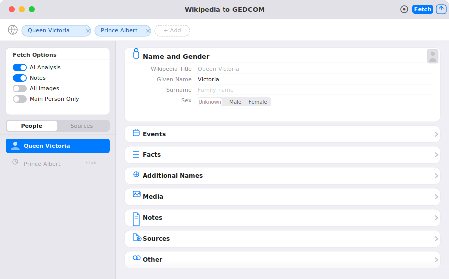
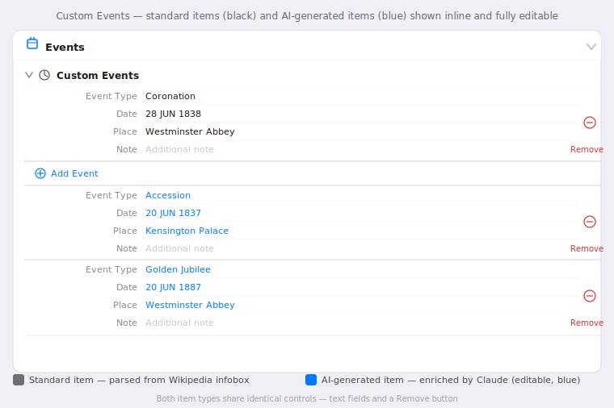

# WikipediaScraper

A Swift toolkit that converts Wikipedia biography articles into standards-compliant **GEDCOM 7.0** genealogy files. The toolkit ships in three forms that share the same parsing engine:

| Tool | What it is |
|------|-----------|
| **Wikipedia to GEDCOM** (macOS app) | Point-and-click GUI — paste Wikipedia URLs, review and edit all parsed data, then export |
| **Wikipedia to GEDCOM** (iPadOS app) | Same editor experience on iPad — touch-friendly URL bar, exports via iOS document picker |
| **WikipediaScraper** (CLI tool) | Scriptable command-line tool — batch processing, automation, advanced options |

---

## macOS App — Wikipedia to GEDCOM

### Installation

**Option A — Xcode (recommended for debugging and development)**

```bash
git clone https://github.com/psteinauer/WikipediaScraper.git
cd WikipediaScraper
make xcode                  # opens WikipediaScraper.xcworkspace in Xcode
```

Select the **Wikipedia to GEDCOM (macOS)** scheme, choose your Mac as the run destination, and press Run (⌘R).

**Option B — command-line release build**

```bash
git clone https://github.com/psteinauer/WikipediaScraper.git
cd WikipediaScraper
make app-release
# app lands at: build/Build/Products/Release/WikipediaScraperApp.app
cp -r build/Build/Products/Release/WikipediaScraperApp.app /Applications/
```

On first launch macOS may show an unidentified-developer warning — right-click → Open → Open to dismiss it once.

### How to use it

1. **Paste Wikipedia URLs** into the address bar at the top. Each URL becomes a chip; add as many people as you like, then press ⌘↩ (or click the fetch button) to load them all at once. The app fetches automatically when a URL is added if no fetch is already running.
2. The app fetches each article, parses the infobox, and populates all fields. Fetched people appear in the **People** list in the sidebar. On launch, if URLs are saved from a previous session and the people list is empty, the app re-fetches all URLs automatically.
3. **Set fetch options** in the sidebar panel before (or after) fetching:
   - **AI Analysis** — enriches data with Claude AI (requires an Anthropic API key).
   - **Notes** — appends Wikipedia article sections as GEDCOM NOTE records.
   - **All Images** — downloads every article image into the ZIP export.
   - **Main Person Only** — exports only the explicitly-fetched people; no family stubs.
4. **Select a person** from the sidebar to review and edit their data in the detail panel.
5. **Export** using the toolbar Export button or the File menu:
   - **Export as GEDCOM… (⌘E)** — saves a plain `.ged` text file.
   - **Export as ZIP… (⌘⇧E)** — saves a GEDZIP archive containing `gedcom.ged` plus all portrait and media images.
   - **Open in MacFamilyTree 11** — exports a ZIP and opens it directly in MacFamilyTree.
   - **View GEDCOM…** — previews the raw GEDCOM text in a scrollable sheet with copy and save options.

### Share to app

The macOS app installs a **Share Extension** (`WikipediaToGEDCOMShareMac`). To send a Wikipedia page directly from Safari or Chrome:

1. Click the Share button in the browser toolbar (or use the Share menu item).
2. Choose **Wikipedia to GEDCOM** from the sharing destinations.
3. A small confirmation sheet appears showing the URL. Click **Add** to send it to the app, or **Cancel** to dismiss.
4. The app opens (or comes to the front) and begins fetching the article immediately.

The macOS app also registers as a **Services provider**. Any application that supports the macOS Services menu can send a selected URL to the app via **Services > Add to Wikipedia to GEDCOM**.



### Settings

Click the **gear icon** (or wand icon when AI Analysis is enabled) in the toolbar to open the settings popover. This is where you configure the **Claude AI API key**. The fetch options (Notes, All Images, Main Person Only) are always visible in the sidebar.

### Person detail view

The detail panel shows the selected person's data organised into eight collapsible sections:

| Section | Contents |
|---------|----------|
| **Name and Gender** | Wikipedia title (read-only), given name, surname, sex. The person's primary image appears to the right of this card when available. |
| **Events** | Birth, Death, Burial, Baptism (date/place/note/cause); Spouses; Titled Positions; Custom Events. **AI-generated events appear inline in blue** — same edit controls as standard events. |
| **Facts** | Honorifics; Custom facts (type + value); Occupations; Attributes (nationality, religion). **AI-generated titles and facts appear inline in blue.** |
| **Additional Names** | Birth name. **AI-generated alternate names appear inline in blue**, each individually editable. |
| **Media** | Primary image URL with live preview; additional media items with captions |
| **Notes** | Wikipedia article sections (populated when Notes is enabled) |
| **Sources** | Wikipedia article citation; AI Analysis citation (shown when AI Analysis has run) |
| **Other** | Parents (father, mother); Children. **AI-identified influential people appear inline in blue** with name, relationship, and note fields. |

When **AI Analysis** is enabled, all Claude-enriched items are integrated directly into the relevant sections and shown in **blue text** to distinguish them from infobox-parsed data. They are fully editable and deletable — identical in behaviour to standard items. When AI Analysis results arrive, sections containing new data **automatically expand** so results are immediately visible.



**Expand and collapse shortcuts:**

| Click | Effect |
|-------|--------|
| Plain click on section header | Toggle that section only |
| ⌥ click on section header | Toggle the section and all its sub-sections |
| ⌘⌥ click on section header | Toggle all other top-level sections (sub-section states unchanged) |

All sections except **Name and Gender** start collapsed by default.

---

## iPadOS App — Wikipedia to GEDCOM

### Installation

**Option A — Xcode (recommended)**

```bash
make xcode      # opens WikipediaScraper.xcworkspace in Xcode
```

Select the **Wikipedia to GEDCOM (iPadOS)** scheme, choose a connected iPad or simulator, and press Run (⌘R).

**Option B — simulator from the command line**

```bash
make ipad-sim                                    # iPad Pro 13-inch (M5) simulator
make ipad-sim IPAD_SIM_NAME="iPad Air 13-inch (M2)"  # different simulator
```

**Option C — device release build**

```bash
make ipad       # builds for a connected device; use Xcode to install the .ipa
```

### How to use it

1. **Paste Wikipedia URLs** into the address bar at the top and tap Return (or the fetch button). The app fetches the article immediately when a URL is added.
2. The app fetches each article and populates the People list. On launch, saved URLs are re-fetched automatically if the people list is empty.
3. **Set fetch options** in the strip below the URL bar: AI Analysis, Notes, All Images, Main Person Only.
4. **Select a person** from the sidebar to review and edit their data.
5. **Export** using the toolbar button (top-right):
   - **Export as GEDCOM…** — opens the iOS document picker to save a `.ged` file.
   - **Export as ZIP…** — downloads all media, then opens the document picker to save a `.zip` GEDZIP archive.

Tap the **gear icon** in the toolbar to configure the Claude AI API key.

### Share to app

The iPadOS app installs a **Share Extension** (`WikipediaToGEDCOMShare`). To send a Wikipedia page directly from Safari or another browser:

1. Tap the Share button and choose **Wikipedia to GEDCOM**.
2. The extension immediately routes the URL to the app via the `wikipedia-gedcom://` URL scheme — no confirmation sheet is shown.
3. The app opens (or comes to the front) and begins fetching the article.

The iPadOS app supports all four orientations and multi-window (Stage Manager) on supported hardware.

---

## CLI Tool — WikipediaScraper

### Installation

```bash
make install          # builds release binary → /usr/local/bin/WikipediaScraper
```

Or install to a custom location:

```bash
make install INSTALL_PREFIX=~/.local/bin
```

### Usage

```
WikipediaScraper [options] <URL> [<URL> ...]
```

### Arguments

| Argument | Description |
|----------|-------------|
| `<URL> ...` | One or more full Wikipedia article URLs |

### Options

| Flag / Option | Short | Description |
|---------------|-------|-------------|
| `--output <path>` | `-o` | Override output file path |
| `--verbose` | `-v` | Print progress to stderr |
| `--preflight` | `-p` | Write GEDCOM to stdout (no file written) |
| `--zip` | `-z` | Create GEDZIP archive (`.zip` default; use `--output` for `.gdz`) |
| `--mappings` | `-m` | Print field-mapping table; no GEDCOM produced |
| `--notes` | `-n` | Append Wikipedia article sections as NOTE records |
| `--allimages` | `-a` | Download all article images into GEDZIP (implies `--zip`) |
| `--nopeople` | | Only create records for the URLs passed; skip referenced-person fetching |
| `--config <path>` | | Use a specific `.wikipediascraperrc` file |
| `--help` | `-h` | Show help |
| `--version` | | Show version |

### Output modes (mutually exclusive)

| Mode | Default output |
|------|----------------|
| Default | `<ArticleTitle>.ged` in current directory |
| `--preflight` | stdout |
| `--zip` / `--allimages` | `<ArticleTitle>.zip` (or `.gdz` via `--output`) |
| `--mappings` | stdout (diagnostic table, no GEDCOM) |

When multiple URLs are provided, the default output filename is `<FirstTitle>_et_al.ged` / `.zip`.

### Examples

```bash
# Single person, default .ged output
WikipediaScraper https://en.wikipedia.org/wiki/George_Washington

# Custom output path
WikipediaScraper --output ~/genealogy/washington.ged \
    https://en.wikipedia.org/wiki/George_Washington

# GEDZIP archive with portrait image
WikipediaScraper --zip https://en.wikipedia.org/wiki/Elizabeth_II

# GEDZIP with .gdz extension
WikipediaScraper --zip --output royals/elizabeth.gdz \
    https://en.wikipedia.org/wiki/Elizabeth_II

# Inspect GEDCOM output without writing a file
WikipediaScraper --preflight https://en.wikipedia.org/wiki/Napoleon

# Include full article text as notes
WikipediaScraper --preflight --notes https://en.wikipedia.org/wiki/Napoleon

# Download all article images into the archive
WikipediaScraper --allimages https://en.wikipedia.org/wiki/Queen_Victoria

# Diagnostic field-mapping table
WikipediaScraper --mappings https://en.wikipedia.org/wiki/Napoleon

# Multiple people in one file (deduplicated, shared FAM records)
WikipediaScraper --zip \
    https://en.wikipedia.org/wiki/Queen_Victoria \
    https://en.wikipedia.org/wiki/Prince_Albert

# Verbose output
WikipediaScraper --verbose --zip https://en.wikipedia.org/wiki/Napoleon
```

---

## Requirements

| Target | Minimum version |
|--------|----------------|
| macOS app | macOS 13 (Ventura) |
| iPadOS app | iOS / iPadOS 16 |
| CLI tool | macOS 13 (Ventura) |
| Build tools | Swift 5.9+ (Xcode 15+) |

An internet connection is required to fetch Wikipedia articles and images.

---

## Features (all tools)

- Parses Wikipedia infoboxes (`royalty`, `officeholder`, `biography`, `military person` templates) into structured genealogy data
- Outputs GEDCOM 7.0 with full compliance: correct xrefs, UTF-8, CONT line-splitting, proper tag hierarchy
- Accepts **multiple Wikipedia URLs** — all persons land in one GEDCOM file; the macOS and iPadOS apps show each person in a sidebar list
- Automatically fetches Wikipedia data for **referenced people** (spouses, parents, children) one level deep
- Persons referenced by multiple input URLs are **deduplicated** — one INDI record, one FAM record, shared across all contexts
- Downloads portrait images from Wikimedia and packages them into a **GEDZIP archive**
- Optionally downloads **every article image** into the archive (`--allimages` / All Images option)
- **AI Analysis** via Claude API (Anthropic) — enriches each article with alternate names, titles, facts, events, and influential people; results appear **inline in blue** within the relevant editor sections and are stored separately in the GEDCOM output cited as "Claude AI (Anthropic)"
- **MacFamilyTree 11 integration** (macOS app) — one-click export and open
- **GEDCOM preview** (macOS app) — scrollable, selectable, monospace view of the raw GEDCOM output with copy and save options
- **Share Extension** (macOS and iPadOS) — send a Wikipedia URL from Safari or Chrome directly to the app
- Emits titled positions (reign, office) as **GEDCOM EVEN with TYPE "Nobility title"**
- Predecessor/successor links use **ASSO + RELA** (Influential Persons)
- Source citations use **SOUR.WWW** (top-level domain) + **PAGE** (specific article URL) + **DATA.TEXT** (article extract)
- Field-mapping diagnostic report shows exactly how each infobox field was interpreted (CLI `--mappings`)

---

## Configuration file — `.wikipediascraperrc`

WikipediaScraper supports a plain-text configuration file that customises how Wikipedia infobox fields are mapped to GEDCOM facts and events.

### File locations

The tool searches in this order:

1. Path supplied with `--config <path>`
2. `.wikipediascraperrc` in the **current working directory**
3. `~/.wikipediascraperrc` in your **home directory**

### File format

```ini
# ~/.wikipediascraperrc

[facts]
# field_name = FACT TYPE display name
party         = Political Party
house         = Royal House
awards        = Honour
religion      = Religious Affiliation
alma_mater    = Education

[events]
# field_name = EVEN TYPE display name
coronation          = Coronation
inauguration_date   = Inauguration
```

### Built-in fields you can rename

| Section | Infobox field | Default display name |
|---------|--------------|----------------------|
| `[facts]` | `party` | `Political party` |
| `[facts]` | `house` / `dynasty` / `royal_house` | `House` |
| `[facts]` | `awards` | `Award` |
| `[facts]` | `branch` | `Military branch` |
| `[facts]` | `rank` | `Military rank` |
| `[facts]` | `allegiance` | `Allegiance` |
| `[facts]` | `service_years` | `Service years` |
| `[facts]` | `battles` / `battles/wars` | `Battle` |
| `[events]` | `coronation` | `Coronation` |

---

## GEDZIP archive structure

```
archive.zip (or .gdz)
├── gedcom.ged              GEDCOM 7.0 file (FILE tags use relative paths)
└── media/
    ├── Person_Name.jpg     Portrait downloaded from Wikimedia
    └── Image_Caption.jpg   Additional images (--allimages / All Images option)
```

---

## GEDCOM 7.0 output

### Name records

| NAME record | Source | Notes |
|------------|--------|-------|
| Primary `NAME` | Wikipedia article title | `GIVN` + `SURN` subrecords; `NPFX` for honorific prefix |
| Additional `NAME` | Infobox structured name | Added when it differs from the article title |
| `NAME TYPE birth` | `birth_name` | Birth / maiden name |
| `NAME TYPE aka` | Alternate names | From infobox and AI Analysis |

### INDI record tags

| GEDCOM tag | Source |
|------------|--------|
| `NAME` | Wikipedia article title with `GIVN`/`SURN`/`NPFX` |
| `SEX` | `gender`, `sex`, `pronouns` |
| `BIRT` / `DEAT` / `BURI` / `BAPM` | Date + place + note; `DEAT` adds `CAUS` |
| `TITL` | Simple honorifics (no date range) |
| `EVEN TYPE "Nobility title"` | Reign / office with `DATE FROM … TO` |
| `FACT TYPE "<name>"` | House, party, branch, rank, awards, battles |
| `OCCU` | One tag per occupation |
| `NATI` / `RELI` | Nationality, religion |
| `ASSO RELA Predecessor/Successor` | Predecessor/successor links |
| `NOTE` | Wikipedia article sections (`--notes` / Notes option) |
| `FAMS` / `FAMC` | Family links |
| `SOUR` | Wikipedia article with `PAGE` + `DATA.TEXT` |
| `OBJE` | Portrait + additional images |

### Date handling

| Input | GEDCOM output |
|-------|---------------|
| `24 May 1819` | `24 MAY 1819` |
| `{{birth date\|1819\|5\|24}}` | `24 MAY 1819` |
| `c. 1066` / `circa 1066` | `ABT 1066` |
| `before 1200` | `BEF 1200` |
| `after 1400` | `AFT 1400` |
| `20 June 1837 – 22 January 1901` | `FROM 20 JUN 1837 TO 22 JAN 1901` |

---

## Referenced-person expansion

By default the tool extracts Wikipedia article links from family fields (spouses, children, father, mother) and automatically fetches each referenced person, including them as full INDI records — one level deep, without recursion.

Use `--nopeople` (CLI) or the **Main Person Only** option (apps) to include only the explicitly-specified URLs. Referenced people not on the list become minimal stub records. Two explicitly-fetched people who are married to each other still share a FAM record.

---

## Opening in Xcode

The recommended way to open the project in Xcode is the workspace, which combines all targets:

```bash
open WikipediaScraper.xcworkspace
```

Individual Xcode projects are also available:

| Project | Contents |
|---------|----------|
| `WikipediaScraperMac.xcodeproj` | macOS app (`WikipediaScraperApp`), macOS Share Extension (`WikipediaToGEDCOMShareMac`), CLI tool (`WikipediaScraper`) |
| `WikipediaScraperIPad.xcodeproj` | iPadOS app (`WikipediaScraperIPad`), iPadOS Share Extension (`WikipediaToGEDCOMShare`) |

### Xcode schemes

| Project / Workspace | Scheme | Builds |
|---------------------|--------|--------|
| `WikipediaScraperMac.xcodeproj` | Wikipedia to GEDCOM (macOS) | macOS app + Share Extension |
| `WikipediaScraperMac.xcodeproj` | WikipediaScraper CLI | CLI tool only |
| `WikipediaScraperIPad.xcodeproj` | Wikipedia to GEDCOM (iPadOS) | iPadOS app + Share Extension |
| `WikipediaScraper.xcworkspace` | Build All | All three top-level targets |

---

## Build targets

| Command | Description |
|---------|-------------|
| `make all` | Build every target (macOS app + extensions + CLI + iPadOS app) via the workspace |
| `make build` | CLI debug binary via SPM → `.build/debug/WikipediaScraper` |
| `make release` | CLI optimised release binary via SPM → `.build/release/WikipediaScraper` |
| `make install` | CLI release binary installed to `/usr/local/bin` |
| `make install INSTALL_PREFIX=<dir>` | CLI installed to a custom directory |
| `make app` | macOS app + Share Extension (Debug) → `build/Build/Products/Debug/WikipediaScraperApp.app` |
| `make app-release` | macOS app + Share Extension (Release) → `build/Build/Products/Release/WikipediaScraperApp.app` |
| `make ipad-sim` | iPadOS app + Share Extension built for iPad Pro 13-inch (M5) simulator, then launched |
| `make ipad-sim IPAD_SIM_NAME="<name>"` | Same, targeting a named simulator |
| `make ipad-sim-reset` | Erase and reboot the iPad simulator (fixes stale-state crashes) |
| `make ipad` | iPadOS app + Share Extension (Release) built for a connected device |
| `make xcode` | Open `WikipediaScraper.xcworkspace` in Xcode |
| `make icons` | Regenerate all app icon PNGs (macOS + iPadOS) from `make_icon.swift` |
| `make clean` | Remove `./build/` and SPM build artefacts |
| `make test` | Smoke-test CLI against the George Washington Wikipedia article |

---

## Source code layout

```
WikipediaScraper.xcworkspace/          Xcode workspace — opens all targets together
WikipediaScraperMac.xcodeproj/         Xcode project: macOS app + Share Extension + CLI
WikipediaScraperIPad.xcodeproj/        Xcode project: iPadOS app + Share Extension
WikipediaScraperMac.entitlements       macOS app entitlements (outgoing URL scheme, etc.)
WikipediaToGEDCOMShareMac.entitlements macOS Share Extension entitlements
WikipediaScraperIPad.entitlements      iPadOS app entitlements
WikipediaToGEDCOMShare.entitlements    iPadOS Share Extension entitlements

Sources/
├── WikipediaScraperCore/          Shared library (CLI + macOS app + iPadOS app)
│   ├── PersonModel.swift          Data model — PersonData, GEDCOMDate, SpouseInfo, …
│   ├── WikipediaClient.swift      Wikipedia REST + MediaWiki API calls
│   ├── InfoboxParser.swift        Wikitext infobox → PersonData extraction
│   ├── DateParser.swift           Wikipedia date strings → GEDCOMDate
│   ├── GEDCOMBuilder.swift        PersonData → GEDCOM 7.0 text
│   ├── GEDZIPBuilder.swift        GEDCOM + media files → ZIP/GEDZIP archive
│   ├── MappingsReporter.swift     Diagnostic field-mapping table (--mappings)
│   └── ScraperConfig.swift        .wikipediascraperrc loader
│
├── WikipediaScraperSharedUI/      Shared SwiftUI library (macOS + iPadOS)
│   ├── EditableTypes.swift        Editable model types — EditablePerson, EditableEvent, …
│   ├── PersonEditorView.swift     PersonEditorView, EditorSection, SubGroup, FieldRow,
│   │                              EventSectionContent, MediaThumbnail
│   ├── FetchOptionsView.swift     Fetch options card (macOS sidebar) / chip strip (iPad)
│   ├── LLMSettings.swift          Persistent Claude AI settings (API key, enabled flag)
│   ├── AIProgressSheet.swift      AI analysis progress modal sheet
│   ├── GEDCOMPreviewSheet.swift   GEDCOM preview modal (monospace, copy, save)
│   ├── SourceInfo.swift           SourceInfo type — name, icon, URL for sources list
│   ├── SourceDetailView.swift     Source detail panel
│   └── URLListBar.swift           Shared URL chip utilities
│
├── WikipediaScraper/              Command-line tool target
│   └── WikipediaScraperCommand.swift  Entry point, argument parsing, orchestration
│
├── WikipediaScraperApp/           macOS SwiftUI app target
│   ├── WikipediaScraperApp.swift  @main, @NSApplicationDelegateAdaptor, FocusedValues,
│   │                              menu bar commands; WindowGroup.handlesExternalEvents(matching:[])
│   ├── AppDelegate.swift          NSApplicationDelegate — routes wikipedia-gedcom:// URLs
│   │                              via URLRouter; handles reopen; registers Services provider
│   ├── URLRouter.swift            @MainActor singleton — delivers URL-scheme events to the
│   │                              active window's handler; queues URLs on cold launch
│   ├── ContentView.swift          URL chip bar, sidebar, detail panel, toolbar
│   ├── PersonViewModel.swift      ObservableObject ViewModel — fetch, export, AI, preview;
│   │                              handleOpenURL, addURL, removeURL, fetchOnLaunch
│   ├── LLMSettingsView.swift      Settings popover — Claude AI API key
│   ├── Info.plist                 macOS bundle metadata
│   └── Assets.xcassets/           macOS app icon (7 PNG sizes)
│
├── WikipediaToGEDCOMShareMac/     macOS Share Extension target
│   ├── ShareViewController.swift  NSViewController confirmation sheet (title label,
│   │                              URL label, Add / Cancel buttons); opens app via
│   │                              wikipedia-gedcom://add?url=<encoded>
│   └── Info.plist                 Extension metadata (NSExtension, NSServices)
│
├── WikipediaToGEDCOMShare/        iPadOS Share Extension target
│   ├── ShareViewController.swift  UIViewController that immediately routes the shared URL
│   │                              to the containing app via wikipedia-gedcom://add?url=…
│   └── Info.plist                 Extension metadata
│
└── WikipediaScraperIPad/          iPadOS SwiftUI app target
    ├── WikipediaScraperIPadApp.swift  @main (iOS) + macOS stub for swift build;
    │                                  onOpenURL → handleOpenURL → addURL
    ├── iPadContentView.swift      Touch-optimised URL bar, .fileExporter modifiers
    ├── iPadPersonViewModel.swift  ViewModel — fetch + iOS document picker export
    ├── Info.plist                 iPadOS bundle metadata
    └── Assets.xcassets/           iPad app icon (9 PNG sizes)

make_icon.swift                    Icon generator — regenerates macOS + iPadOS PNGs
```

---

## Dependencies

| Package | Version | Purpose |
|---------|---------|---------|
| [swift-argument-parser](https://github.com/apple/swift-argument-parser) | ≥ 1.3.0 | CLI argument / flag / option parsing |
| [ZIPFoundation](https://github.com/weichsel/ZIPFoundation) | ≥ 0.9.19 | GEDZIP archive creation |

---

## Limitations

- English Wikipedia only (`en.wikipedia.org`)
- Infobox parsing covers the most common templates; unusual or highly customised infoboxes may produce incomplete data — use `--mappings` to diagnose
- Date parsing handles the most common Wikipedia date formats; highly non-standard formats fall back to an empty date
- Referenced-person expansion is one level deep; it does not recursively follow the family trees of fetched persons
- `--allimages` / All Images skips small images (< 100×100 px), icons, flags, logos, and other decorative images based on filename heuristics
- AI Analysis requires a valid Anthropic API key; usage is billed to your Anthropic account

---

## License

MIT
